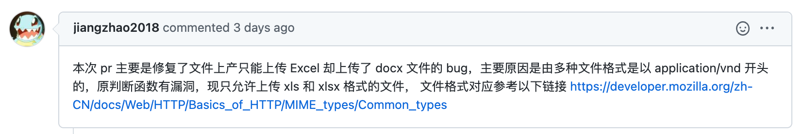
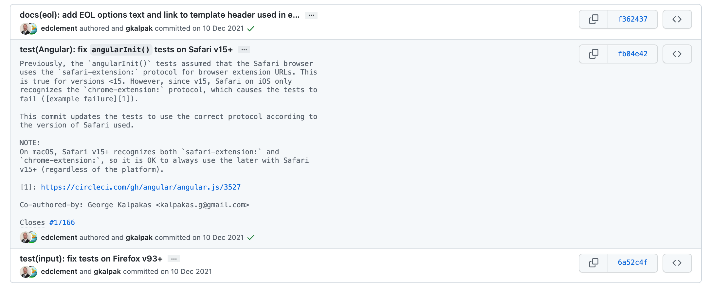

# Development Spec

> WIP

开发规约往往极具组织特色与一些团队偏好，不同组织、不同项目的开发规约不尽相同。尽管如此，不同规约的本质都是一致的，所追寻的软件工程的“道”都相同，不同规约文档主要差异也只是体现在“术”上的选择上。本文作为 lawporter organization 下的规约文档，是基于组织成员过去的开发经历归纳总结而成，可供新的开源项目、新的组织或是还未形成成熟规范的团队参考，也欢迎大家对此文档上的内容进行讨论，进一步优化本文的一些实践内容。

本文是 lawporter organization 下的一些通用的规范要求，它用以约定组织下整体项目开发风格。本规约主要针对的是一些语言无关的，全局的开发内容，具体到每种语言的实践，请参考：

* [Golang](https://github.com/lawporter/go-project-spec)
* More...

## 文档规范

### README 规范

README 文件用以介绍项目的主要内容，注意事项，README 包含至少以下内容：

```markdown
# Project Title

A brief description of what this project does and who it's for

## Features

- Light/dark mode toggle
- Live previews
- Fullscreen mode
- Cross platform

## Quick Start

How to start your project

## Documentation

[Documentation](https://linktodocumentation)
```

简单的说，一个项目的 README 必须（**MUST**）至少说明清楚这个项目是什么，有什么用，怎么使用它，使用文档在哪以及一些额外需要注意的点。本文给出的示例是至少需要包含的内容，根据项目本身的特点可以（**MAY**）添加更多的模块，比如 Ref、FAQ，可以（**MAY**）参考 [readme.so](https://readme.so/) 在项目中增加合适的模块。

### 项目文档规范

一切值得被留痕的的内容都应该被文档化。可以被文档化的东西林林总总，并且一些需要文档化的内容有些可以被进一步模版化，在此只能给出一些常见的应该（**SHOULD**）被文档化的内容，随着时间的推移不断细化本模块：

| 文档         | 类型     | 描述                                                         |
| ------------ | -------- | ------------------------------------------------------------ |
| 产品业务功能 | 产品文档 | 用以说明本产品具有的业务功能，大模块下应当还会作进一步细分，<br/>比如业务子模块、需求变更、用户反馈等。这部分和业务紧绑定，不做展开。 |
| 实施方案     | 开发文档 | 产品整体技术路线，包括调研过程、技术方案对比、技术选项、实施方案。 |
| 最佳实践     | 开发文档 | 最佳实践主要存放一些该项目技术方案实施过程中的相关实践，<br/>包括实施过程、实施收益等。 |
| 开发流程     | 开发文档 | 开发流程用以明确一些项目全生命周期管理的通用内容，<br/>比如项目部署、测试覆盖率、CICD 流程、测试环境等。 |
| 使用手册     | 开发文档 | 如何使用该项目，根据实际内容进一步可能划分多个文档，<br/>比如接口文档、错误码、SDK 使用、项目目录说明等。 |
| 重构备忘录   | 开发文档 | 大部分项目都有需要重构的内容，有时候重构项可能随着时间推移<br/>不断增加，备忘录帮助大家时刻回顾需要重构的项目并及时排期。 |
| 更多……       |          |                                                              |

如何管理一个组织下的文档是一个政治问题，通常来说处理方式主要有三种——分布式、集中式和混合式。

* 分布式：即各个 repo 下各自维护各自的文档。这样的好处是很多东西都可以就地查找，不需要去另外一个 repo 寻找；坏处是一个 repo 下的文档不可避免的有许多重复的东西；
* 集中式：集中式是将所有文档放在一个统一的地方进行管理。这样的好处是方便组织管理，并且文档的结构可以更加清晰，项目间的查询也更加方便，方便迁移；坏处是开发者不得不同时维护多个 repo，文档与 repo 之间的对齐需要另外约定；
* 混合式：分布式加集中式的文档管理。

考虑到目前我们组织的架构性问题与项目的特点，使用一个**规范目录结构的集中性文档管理**是一个比较好的方案。

## 开发规范

开发规范假定组织下的所有开发者均使用 Git 作为代码版本控制工具，并假设读者对 Git 已经有了一定的了解。

### Git Workflow 规范

一个运作良好的开发团队会按照一定的规范流程进行项目的开发，这类流程规范称为 Git Workflow，常见的 4 种工作流模型有 Git Flow、Github Flow、GitLab Flow 和 One Flow，*[4 branching workflows for Git](https://medium.com/@patrickporto/4-branching-workflows-for-git-30d0aaee7bf)* 这篇文章已将它们之间各自的优缺点阐述的非常清晰了。由于团队成员的日常开发活动均在 GitHub 平台上，并对其工作流程有一定的经验，因此本文的工作流规范基于 [Github Flow](https://docs.github.com/en/get-started/quickstart/github-flow) 并在此基础之上做了些许调整。

**创建一个 Git 分支**：任何涉及项目代码变更的地方都必须（**MUST**）创建一个新的 Git 分支，GIthub Flow 并没有对分支名作出规约，然而本文定义了分支语义化规范，见 [Git 分支命名规范](#git-分支命名规范)。通过创建一个新分支，开发人员可以在不影响其他分支的前提下进行工作，并让其他成员 review 相关工作。

**提交一个 Pull Request**：一旦开发人员完成了自己的工作，开发人员在合并代码之前必须（**MUST**）提交一个 Pull Request 并要求团队成员审查自己的 PR，PR 的提交和审查是一个需要展开的话题，见 [PR 提交与审查规范](#pr-提交与审查规范)。

**合并一个 Pull Request**：一旦开发人员的 PR 被审核通过，如果代码没有冲突，项目负责人必须（**MUST**）使用 **Squash and merge** 合并代码，如下图：

<div align=center> </div>

另两种 Github 提供的合并选项分别是 **Merge Pull Request** 和 **Rebase and merge**，前者会产生一个冗余的 commit 信息，后者则很容易造成过大的 git history，本文认为这两种选项都不应该（**MUST NOT**）被使用。

如果开发人员的代码在合并之前有冲突需要解决，开发人员应该（**SHOULD**）使用 rebase 的方式解决处理冲突后，再由项目负责人合并代码。

使用 rebase + squash 的代码合并处理方式可以保证项目主分支上每一个 commit 都是包含充足且简明的信息量，并且整个 git history tree 也不会杂乱无章。

**删除 Git 分支**：一旦开发人员的分支被合并，这证明该分支已经完成了它的任务，项目负责人应该（**SHOULD**）删除该分支，从而避免其他开发人员意外的使用了旧分支。

### PR 提交与审查规范

1. 开发人员提交 PR 时不能（**MUST NOT**）取一些毫无意义的 PR 标题，比如 `my cool pull request`，应该（**SHOULD**）和该 PR 所要做的事情一致，PR 标题必须（**MUST**）和 Commit Message Header （见 [Git Commit 规范](#git-commit-规范)）保持一致，如 `fix(scheduler): avoid process starvation problem`；
2. 一个 PR 只做（**MUST**）一件事情（比如一个优化，一个功能），如果一个 PR 同时包含几件事情请关闭它必将它拆分成几个 PR 重新提交；
3. 每个 PR 必须（**MUST**）添加一段说明性文字对 PR 内容作介绍。比如为什么有这个 PR、这个 PR 做了什么事情，这个 PR 修复了什么 Bug 等，说明文字的主要目的是帮助参与 review 的开发人员更好的对代码内容进行审查，提高审查效率。对于 fix 类型的 PR，应当（**SHOULD**） 解释造成问题的原因以及解决的办法，对于 feat 的 PR，应当（**SHOULD**）附加设计文档。这里给个示例：

<div align=center> </div>

4. 在提交 PR 之前，开发人员必须（**MUST**）先完成方案审查与代码自测；
5. 单次 PR 的代码修改量不应该（**SHOULD NOT**）超过一定行数（比如说 300 行），测试代码或一些整体性代码的变更不算在內。不同项目对于单个 PR 的代码修改量行数可以（**MAY**）自行约定；
6. 当单次 PR 的代码修改量超过一定行数时（比如说 200 行，由项目团队自行约定）或该 PR 涉及修改的内容众多时，开发人员应（**SHOULD**）发起一次会议评审，将代码核心内容做一次系统性介绍帮助他人审查；
7. 每次 PR 应（**SHOULD**）保证项目团队成员超过半数的人员审查过代码内容后才能合并 PR，每个 PR 应当（**SHOULD**）在发起后的 24 小时内完成 review；
8. 审查人员应该（**SHOULD**）理解被审查代码的设计思路以及全部代码含义，若审查人员 review 对代码内容有问题需要沟通时，除了使用基本的 PR Comment 机制，还可以（**MAY**）约定开发人员一起结对过一遍代码审查流程。

### 版本规范

版本规范必须（**MUST**）使用 Github 起草的语义化版本控制规范，本文档只摘录其中最基本最重要的规范要求，完整草案见 [SemVer](https://semver.org/lang/zh-CN/)。

> 版本格式：主版本号.次版本号.修订号，版本号递增规则如下：
>
> 1. 主版本号：当你做了不兼容的 API 修改，
> 2. 次版本号：当你做了向下兼容的功能性新增，
> 3. 修订号：当你做了向下兼容的问题修正。
>
> 先行版本号及版本编译信息可以加到“主版本号.次版本号.修订号”的后面，作为延伸。

### Git Commit 规范

社区有多种 Commit Message 规范，根据往前项目使用经验与开发团队整体风格，Commit 规范基本参照 Angular 的语义化规范提交，本文档列出项目中使用 Commit Message 中 Header 的基本要素，其他内容如若本文没有声明，均以 Angular 草案为准，完整草案内容见 [Angular Commit Message Guidelines](https://github.com/angular/angular.js/blob/master/DEVELOPERS.md#-git-commit-guidelines)。

Header 的内容必须（**MUST**）是英文，Body 和 Footer 可以（**MAY**）是中文。

Header 包括 type（REQUIRED）、scope（OPTIONAL）和 subject（REQUIRED），type 必须（**MUST**）是以下几种类型之一：

- **feat**：新的功能；
- **fix**：对 BUG 的修复；
- **perf**：代码变更带来的性能提升；
- **refactor**：代码内容重构，并不影响性能或是并非 BUG 修复；
- **docs**：文档相关；
- **style**：不修改代码语义的代码风格上的变更（换行，空格等）；
- **test**：增加/修改测试代码；
- **chore**：杂项，比如构建流程、依赖管理或者一些工具的变更。（*这一项一开始 Angular 草案并没有包含，但是后来被添加进草案并被社区广泛大量的使用，可以用来代替 **build** 和 **ci** 关键词以及其他情况*）。

scope 用来说明 commit 的影响范围，它必须（**MUST**）是名词。在项目初期，可以（**MAY**）设置一些粒度比较大的 scope，比如可以按模块或者功能来设置 scope。scope 不是必要的，比如说开发者在一个非主分支下的频繁多次的 commit 纪录，scope 字段可以被省略；但是对于项目主分支而言，在大部分场景下 commit 是能够明确代码变更的作用范围的，因此为了更好的语义化理解，开发人员应该（**SHOULD**）为主分支上的 commit 设置一个清晰的 scope。开发团队可以（**MAY**）在自己的项目中维护一个 scope 的枚举项用以约定该项目使用的 scope。

subject 是 commit 内容的简短描述，必须（**MUST**）使用现在时态，以动词开头并首字母小写，结尾不加句号。

一个好的 Commit Message 例子：

<div align=center> </div>


### Git 分支命名规范

分支命名规范是一个容易被团队忽略的问题，这主要是由于开发者在大多数情况下都是在一个个人的分支上开发然后合并到一个主分支或者功能分支上，不太会被多人同时使用。然而考虑到分支本身的语义性以及一些被随意命名的分支可能在代码仓库中会持续较长的一段时间，本规约仍将分支命名作为一个团队成员需要遵守的规范。

开发者创建一个新的分支时，是为了开发一个功能、修复一些 Bug 或者其他事，这些分支最后会被合并到主分支上。一个分支上要做的事情在创建时已经是明确的，一个分支上做的所有事情在合并到主分支上时也会最终被合并为一次 commit（见[开发工作流规范](#开发工作流规范)），基于此，本文参考了其他开发者对分支命名的[思考](https://stackoverflow.com/questions/273695/what-are-some-examples-of-commonly-used-practices-for-naming-git-branches)并根据本文对 [Git Commit 规范](#git-commit-规范)约定了**分支语义化规范**：

1. 必须（**MUST**）使用一个描述分支类型的单词 **type** 作为分支名的开头，type 必须（**MUST**）是 Git Commit Message Header type 中的一个（即 **feat、fix、perf、refactor、docs、style、test、chore**）且语义一致；
2. 应该（**SHOULD**）使用一个表示分支影响范围的单词或用 `-` 连接的短语 **scope**  作为分支名的第二个单词，类似 Git Commit Message Header scope，scope 用来描述功能或者模块；
3. 必须（**MUST**）使用 `/` 区分不同的单词，比如 `feat/homepage`；
4. 可以（**MAY**）添加更多的单词或用 `-` 连接的短语对分支进行进一步描述，比如 `feat/homepage/project-intro`，但分支名包含的 `/` 不应该（**SHOULD NOT**）超过 2 个 ；
5. 不能（**MUST NOT**）使用无意义的纯数字作为分支名的一部分，比如 `fix/128`。

使用该分支命名规则兼具简明性与可读性。另一种常被开发人员采用的分支命名规约是使用 `master`、`develop`、 `release-*` 或 `hotfix-*` 中的一个。这种命名方式来源于 [Git Flow](https://nvie.com/posts/a-successful-git-branching-model/) 工作流程中的一环，然而，本文认为这种命名不足以表达全部的语义。
